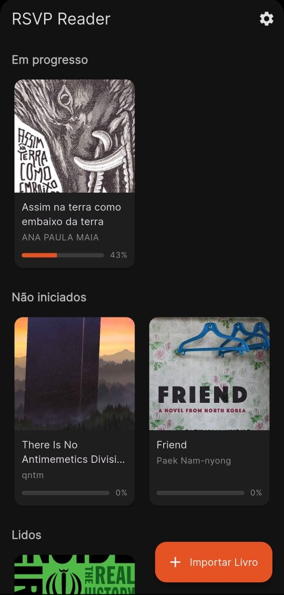
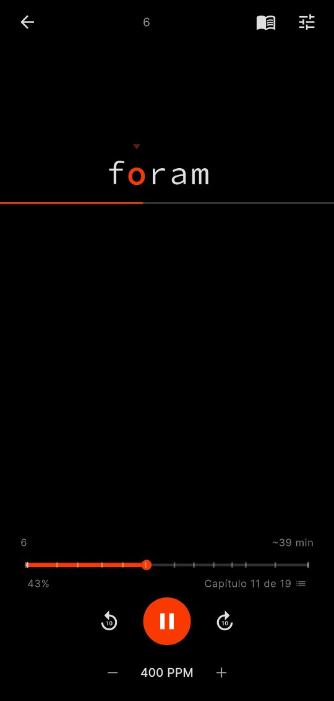
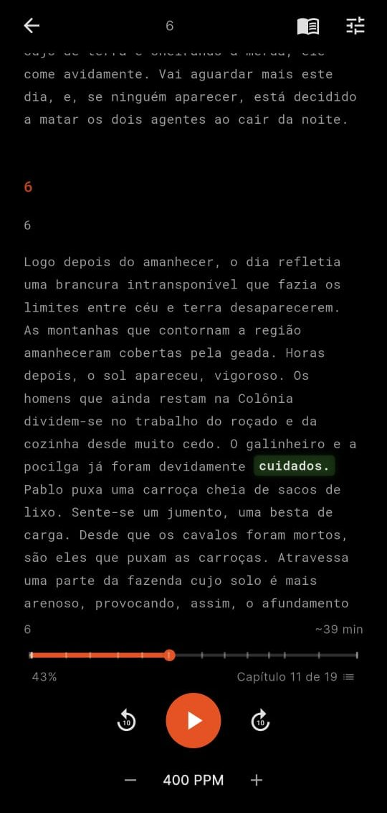
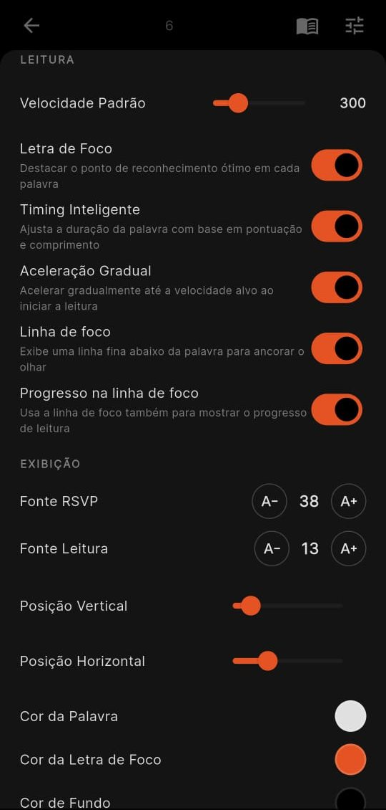

# RSVP Reader

An open-source EPUB reader for Android and iOS built with Flutter, focused on **speed reading** via RSVP (Rapid Serial Visual Presentation).

Words are displayed one at a time at a configurable WPM, with the **Optimal Recognition Point (ORP)** highlighted so your eye doesn't need to saccade — letting you read faster while preserving comprehension.

## Features

- **Three reading modes**
  - `rsvp` — single-word display with ORP highlight, active during playback
  - `scroll` — full text with current-word highlight; pauses and supports tap-to-seek
  - `ereader` — traditional continuous reading without highlights or controls
- **Smart timing** — longer pauses on punctuation, paragraph starts, chapter starts, and long words (all pre-computed at import, zero work in the hot loop)
- **Ramp-up** — starts at 70% of target WPM and accelerates over the first 30 words to help your eyes warm up
- **Chapter-aware progress slider** with visual chapter markers and title tooltips while dragging
- **Velocity-based scroll tracking** — slow scroll moves word-by-word, faster scroll steps by sentence or paragraph
- **Configurable focus line** below the word (plain anchor or progress-bar style)
- **Fully customizable theme** — colors, fonts (Google Fonts), sizes, and layout positions, with live preview
- **Reading stats** — local per-session telemetry feeds a weekly/monthly dashboard (fl_chart) with words-per-day, time, and WPM trend charts
- **Shareable monthly recap** — last.fm-style 9:16 image with finished + in-progress books, exported as PNG via share sheet
- **Book completion celebration** — automatic recap on the last word of a book with time/words/sessions/WPM stats, a 0-5 star rating, and an optional shareable card
- **Bilingual UI** — English and Brazilian Portuguese (PT-BR)
- **Offline-first** — books and progress stored locally in SQLite via Drift
- **Google Drive sync (optional)** — library, reading progress, and display settings sync across devices through a user-owned `RSVP Reader/` folder on Drive (`drive.file` scope, so the app only sees files it created). Android only
- **Unicode-aware ORP calculation** — handles Portuguese accents and punctuation correctly

## Screenshots

| Library | RSVP mode | Scroll mode | Settings |
|---|---|---|---|
|  |  |  |  |

## Getting Started

### Requirements

- Flutter SDK `^3.10.1`
- Android Studio / Xcode for device builds
- On Linux, `lld` must be installed to run tests (`sudo apt install lld`)

### Install & run

```bash
flutter pub get
dart run build_runner build --delete-conflicting-outputs  # generate Drift + Freezed code
flutter gen-l10n                                          # generate i18n bindings
flutter run                                               # run on device/emulator
```

### Other useful commands

```bash
flutter analyze                   # static analysis
flutter test test/                # unit tests
flutter build apk --release       # release Android build
flutter build ios --release       # release iOS build
```

### Google Drive sync (optional)

The app syncs library metadata, reading progress, and display settings through a
`RSVP Reader/` folder it creates in your own Google Drive. The reading features
all work without it — this is only if you want the sync button on the Settings
screen to actually connect.

Because Google OAuth ties the credentials to a specific Cloud project + Android
signing key, if you clone this repo and try to sign in, you'll get
`PlatformException(sign_in_failed, …ApiException: 10)` (DEVELOPER_ERROR). Fix by
provisioning your own OAuth client:

1. Create a project at https://console.cloud.google.com/ and enable the **Google
   Drive API**.
2. **OAuth consent screen** → External → Testing. Add yourself as a Test User.
3. **Credentials → Create OAuth 2.0 Client ID → Android**:
   - Package name: `com.pimenta.rsvp_reader` (or your fork's `applicationId`
     from `android/app/build.gradle.kts`).
   - SHA-1: your debug keystore fingerprint. Get it with:
     ```bash
     keytool -list -v -keystore ~/.android/debug.keystore \
       -alias androiddebugkey -storepass android -keypass android | grep SHA1
     ```
4. Scope: `https://www.googleapis.com/auth/drive.file` (the app only sees files
   it created). No client secret, no `google-services.json`, no manifest change
   needed — `google_sign_in` resolves the OAuth client at runtime via Google
   Play Services.

Currently Android-only. The device/emulator must have Google Play Services
(use a Play-image emulator, not AOSP).

## Architecture

Feature-based **Clean Architecture** with Riverpod state management. Each feature owns its own `domain/`, `data/`, and `presentation/` folders.

```
lib/
  core/         # theme, routing, constants, utils (ORP, timing, HTML stripper, tokenizer)
  database/    # Drift/SQLite: books, reading_progress, cached_tokens
  features/
    book_library/   # book grid + import FAB
    epub_import/    # EPUB parsing pipeline -> WordToken[] cached in SQLite
    rsvp_reader/    # RSVP engine (Ticker-based), display widgets, controls, settings sheet
    settings/       # full-screen settings wrapping the shared display panel
  l10n/         # ARB files (en, pt) + generated
```

**Key concept — `WordToken`:** every word of every book is pre-processed at import time with its ORP index and timing multiplier already calculated. The RSVP engine does *no* computation inside the per-word tick, keeping playback smooth at 600+ WPM.

See [docs/architecture.md](docs/architecture.md) and [docs/rsvp-engine.md](docs/rsvp-engine.md) for detailed documentation on the data flow, state management, ORP math, smart timing multipliers, ramp-up, and velocity-based scroll stepping. [docs/reading-stats.md](docs/reading-stats.md) covers the reading-session model, stats dashboard, and the monthly recap + completion share pipelines. [docs/library-sync.md](docs/library-sync.md) documents the Drive sync pipeline — manifest format, merge rules, tombstone handling, and the DateTime / cache invariants.

## Tech stack

- **Flutter 3.x** / **Dart**
- **Riverpod 2** (state, no codegen — avoids conflict with `drift_dev` / `source_gen`)
- **Drift** over SQLite for persistent storage
- **SharedPreferences** for display/theme settings
- **epub_pro** for EPUB parsing
- **go_router** for navigation
- **google_fonts** + **flex_color_picker** for theming
- **freezed** for immutable data classes

## Credits

- RSVP and ORP concepts are based on established speed-reading research (e.g. Spritz-style presentation). This project implements them with its own ORP lookup table, tokenizer, and timing heuristics tuned for Portuguese and English.
- Open-source libraries listed in [pubspec.yaml](pubspec.yaml).

## Contributing

Contributions are welcome. See [CONTRIBUTING.md](CONTRIBUTING.md) for setup, conventions, and PR guidelines.

## License

[MIT](LICENSE) © 2026 Daniel Pimenta
